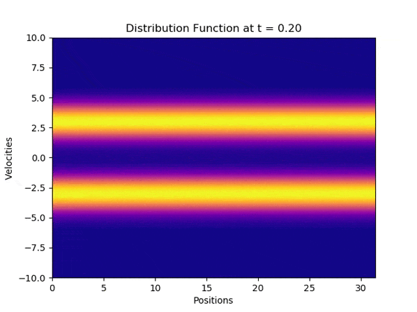

# Computational_Plasma_Physics
Development of numerical tools to solve a 1D-1V Vlasov-Poisson system and a Particle in Cell Kinetic code. The project consists in constructing two numerical solvers: The 1D-1V Vlasov-Poisson system is constructed using a nonlinear coupling of Poisson's Equation and a 2D Advection Equation, and the Particle in Cell code is constructed using a coupling of Poisson's Equation and the Lorentz Force equation with the implementation of a Verlet scheme pusher and a Boris pusher.

## Vlasov-Poisson Simulations:

### Non Linear Landau Damping

### Two Stream Instability
